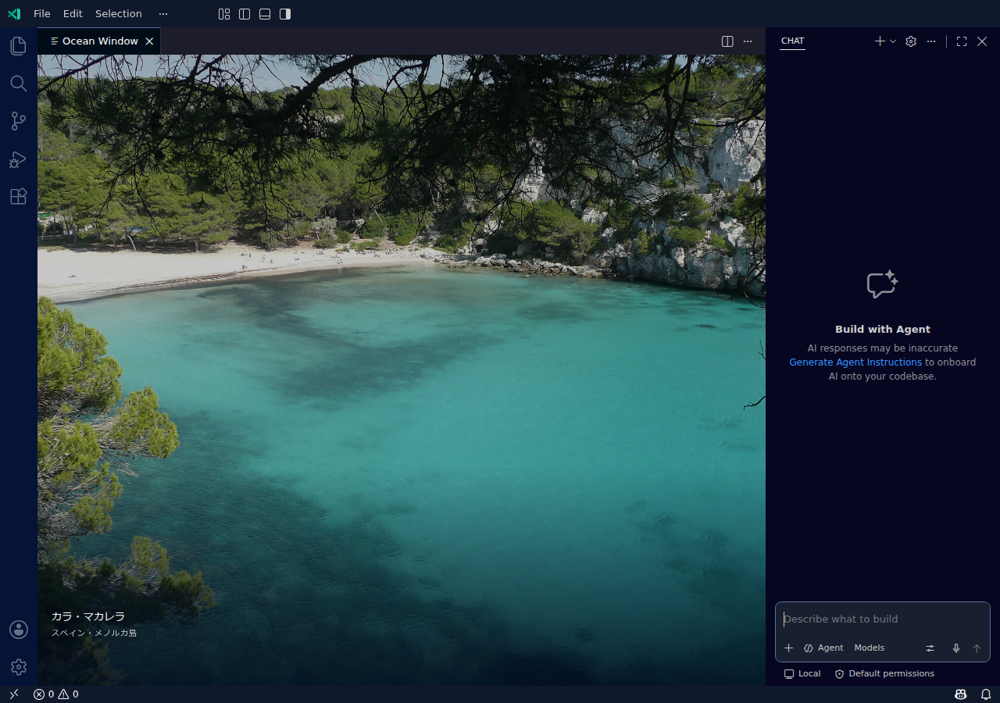

# Ocean Window

A quiet view of the world's oceans, only while your VS Code editor is empty.

何も開いていないエリアを、世界の海が見える窓に。コードや Markdown を開けば、いつもの作業画面に戻ります。

[Install from VS Code Marketplace](https://marketplace.visualstudio.com/items?itemName=zeusu-sato.ocean-window) · [Universal VSIX releases](https://github.com/zeusu-sato/ocean-window/releases) · [Full guide](extension/README.md) · [Issues](https://github.com/zeusu-sato/ocean-window/issues)



Actual Linux VS Code screenshot. Photograph: [Cala Macarella](https://commons.wikimedia.org/wiki/File:Cala_Macarella.jpg) by Paul Stephenson, [CC BY 2.0](https://creativecommons.org/licenses/by/2.0), cropped with a dark overlay.

## Install

Install **Ocean Window** by **Zeusu Sato** from the Marketplace, choosing the pre-release if prompted. Alternatively, download a universal VSIX from GitHub releases and use **Extensions → … → Install from VSIX…**.

Leave an editor group empty and the sea appears automatically. Opening a file closes the temporary Ocean Window tab; closing your files brings it back. **Ocean Window: Turn Off Ocean Window** stops it for this workspace, and **Ocean Window: Show Ocean Window** resumes it.

**Version 0.3 uses the standard Webview API.** Fresh installation needs no application-file changes, administrator access, permission adjustment, or window reload. Its universal package targets Windows, Linux, Intel Macs, and Apple Silicon Macs, in regular VS Code and Insiders 1.130 or later. M1 is not a minimum requirement. See [publication and tested scope](docs/publication.md) and the [Mac guide](docs/macos.md).

## A different sea outside your editor

- Wikimedia Commons supplies real coastal photographs, refreshed online and cached.
- Photos shuffle every 10 minutes without repeating until the current catalog is exhausted.
- Move the pointer over the scene for **Next**, **Pause**, and **Photo credits**.
- Code, Markdown, previews, and other open editors keep their normal background.
- **Ocean Window: Open Settings** changes brightness, timing, captions, and catalog size without reloading.

Closing the sea's tab temporarily dismisses it until you open and close a real editor or use Show Ocean Window. The extension remembers its on/off choice per workspace.

No API key is needed. Ocean Window uses tab state to decide when to appear; it does not read document or chat contents or send workspace information to Wikimedia. See the [full guide](extension/README.md) for network behavior and credits.

## Updating from 0.2.x or the manual prototype

Existing native patches are left alone during an update. If the old wallpaper is detected, run **Ocean Window: Restore Legacy Native Wallpaper**, then reload the affected window once. This cleanup is needed only for a previously applied native patch. The new scene works independently of legacy cleanup.

A failed first enable on Linux that left the application untouched needs no permission adjustment. Its old receipt can be retired without writing to the application. See [Support](extension/SUPPORT.md) and the [legacy Linux recovery note](docs/linux-permissions.md).

The published extension keeps the ID `zeusu-sato.ocean-window`. If the separate `ocean-window-local.ocean-window` prototype is also installed, restore and uninstall that old extension.

## 日本語で使う

Marketplace から **Ocean Window（Zeusu Sato）** をインストールし、エディターを空にすると海が映ります。止めるには **Ocean Window: 海の表示をオフにする**、再開するには **Ocean Window: 海を表示する** を実行します。設定変更も再読み込みなしで反映されます。

0.3 から標準の Webview 方式になり、本体ファイルの変更や管理者権限は不要です。Linux の通常インストールでも、壁紙のための権限設定をする必要はありません。旧版で適用した壁紙が残っている場合だけ、**Ocean Window: 旧方式の壁紙を元に戻す** を実行して一度再読み込みしてください。

## Development

Development uses Node.js and an installed Google Chrome. Browser tests and the icon builder use Playwright's `chrome` channel.

```powershell
npm ci
npm test
npm run preview
```

The renderer preview is served at `http://127.0.0.1:4179`. Browser regressions use credited JPEG fixtures in `assets/photos/` so they do not depend on Wikimedia availability.

```powershell
npm run package:extension
```

The universal VSIX is written to `releases/`. [Publication notes](docs/publication.md) record the verified scope. The standalone native installer and PowerShell wrappers remain in source for legacy recovery and historical tests; they are not the installation path for the 0.3 scene.

Code is [MIT licensed](LICENSE). Photographs retain their individual licenses: see [photo credits](docs/photo-sources.md) and [source metadata](assets/photo-provenance.json).
