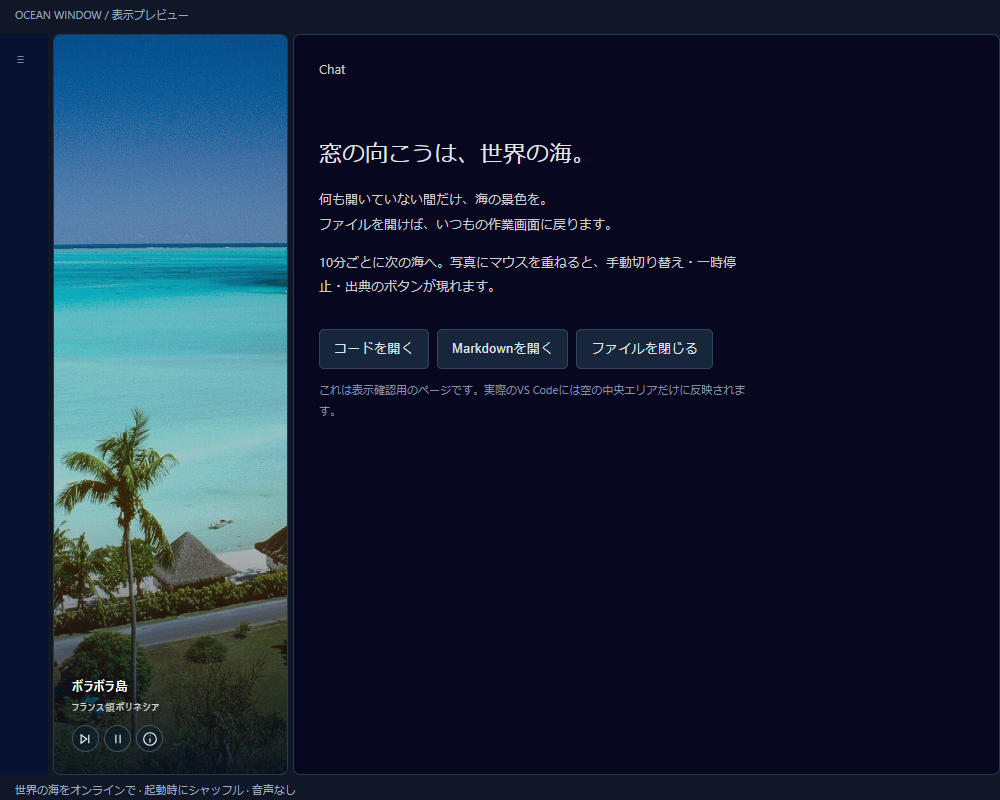

# Ocean Window

A quiet view of the world's oceans, only while your VS Code editor is empty.

何も開いていないエリアを、世界の海が見える窓に。コードや Markdown を開けば、いつもの作業画面に戻ります。

[Install from VS Code Marketplace](https://marketplace.visualstudio.com/items?itemName=zeusu-sato.ocean-window) · [Download universal VSIX](https://github.com/zeusu-sato/ocean-window/releases/download/v0.2.1/ocean-window-0.2.1.vsix) · [Release notes](https://github.com/zeusu-sato/ocean-window/releases/tag/v0.2.1) · [Full guide](extension/README.md) · [Issues](https://github.com/zeusu-sato/ocean-window/issues)



Browser layout preview using the actual wallpaper renderer. Photograph: [Matira Beach, Bora Bora](https://commons.wikimedia.org/wiki/File:Matira_Beach,_Bora_Bora,_French_Polynesia.jpg) by Scott Williams, [CC BY 2.5](https://creativecommons.org/licenses/by/2.5), displayed with a crop and dark overlay.

## Install the preview

1. Install **Ocean Window** by **Zeusu Sato** from the Marketplace link above. Alternatively, download the VSIX and use **Extensions → … → Install from VSIX…**.
2. Open the Command Palette and run **Ocean Window: Enable / Apply Ocean Wallpaper**.
3. Read the customization notice, enable it, and reload the window when your running work is ready.

**Experimental: Ocean Window changes VS Code's installed workbench HTML and triggers its integrity warning.** It preserves the existing Content Security Policy and integrity checks. Installing the extension alone does not apply the wallpaper. The change affects every window and profile using that VS Code installation and may need reapplication after VS Code updates.

Version 0.2.1 is a universal desktop preview for VS Code 1.130 or later, including Insiders. It removes the Windows x64 packaging restriction in 0.2.0. Enabling the wallpaper requires write access to the VS Code installation; on Linux, a user-owned official `.tar.gz` installation can provide this. Read-only Snap installations cannot be patched. See [tested platforms and publication status](docs/publication.md); macOS remains unverified.

## A different sea outside your editor

- Wikimedia Commons supplies real coastal photographs, refreshed online and cached.
- Photos shuffle every 10 minutes, without repeating until the current catalog is exhausted.
- Move the pointer over the scene for **Next**, **Pause**, and **Photo credits**.
- Code, Markdown, previews, and other open editors keep their normal background. Rotation pauses while the editor area is occupied or hidden.
- Use **Ocean Window: Open Settings** to change brightness, timing, captions, and catalog size, then apply and reload.

No API key is needed. The extension does not read or transmit your code, file names, or chat contents. See the [full guide](extension/README.md) for settings, network behavior, and photo credits.

## Restore or migrate

Run **Ocean Window: Restore Original Editor**, then reload **before disabling or uninstalling**. Disabling the extension alone does not remove an applied native patch. A fallback uninstall hook runs after complete removal and a later restart; use the Restore command for immediate removal.

If you installed the earlier `ocean-window-local.ocean-window` preview: restore it, reload, uninstall that old extension, then completely quit and restart VS Code **before enabling this release**. Its delayed cleanup must finish before the replacement applies its wallpaper.

## 日本語で使う

Marketplace から **Ocean Window（Zeusu Sato）** をインストールします。GitHub の VSIX を **… → VSIX からのインストール…** で選ぶ方法も使えます。コマンドパレットで **Ocean Window: 海の壁紙を有効化・設定を適用** を実行し、説明を確認してから、作業が落ち着いたタイミングでウィンドウを再読み込みしてください。

VS Code 本体の表示ファイルを変更する実験的な方式なので、整合性警告が出ます。解除するときは **Ocean Window: 元のエディターに戻す** を実行して再読み込みし、その後に拡張を無効化・削除します。旧 `ocean-window-local` 版から移行する場合は、旧版を復元・削除し、VS Code を完全に終了して起動し直してから新版を有効にしてください。

## Development

Development uses Node.js and an installed Google Chrome; the browser tests and icon builder use Playwright's `chrome` channel. From a clone of this repository:

```powershell
npm ci
npm test
npm run preview
```

The preview is served at `http://127.0.0.1:4179`. Browser regressions use the credited JPEG fixtures in `assets/photos/`, so they do not depend on Wikimedia availability.

To build the VSIX with the publisher identity in the manifest:

```powershell
npm run package:extension
```

The universal package is written to `releases/`. [Publication notes](docs/publication.md) describe the tested scope. The standalone installer is also available through `node tools/install.mjs --dry-run`, `node tools/install.mjs`, and `node tools/install.mjs --uninstall`; its default target is the installed VS Code Insiders. Windows PowerShell wrappers remain available as `./install.ps1 -DryRun`, `./install.ps1`, and `./uninstall.ps1`.

Code is [MIT licensed](LICENSE). Photographs retain their individual licenses: see [photo credits](docs/photo-sources.md) and [source metadata](assets/photo-provenance.json).
